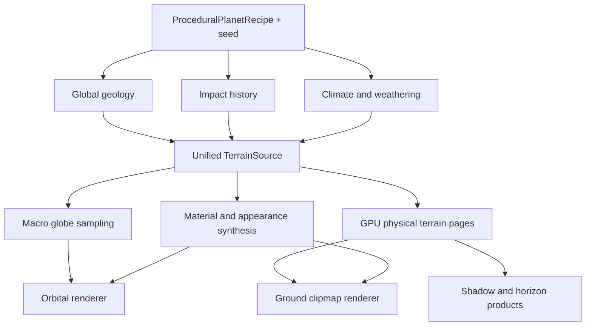

# Planet Patch 1 — Procedural Planet Surface Foundation

Status: **in progress — first vertical slice implemented**

Implemented in the first slice:

- deterministic whole-planet crater recipes in `AnalyticTerrainSource`;
- simple/complex displaced crater bowls, rims, peaks, terraces, ejecta, degradation, and footprint filtering;
- one resolved crater list shared by CPU globe sampling and GPU clipmap generation;
- persisted terrain-surface crater controls;
- geology-aligned dry-world appearance variation from displaced curvature and slope;
- removal of presentation-only crater rings from orbital shading;
- projected-size macro-globe resolution tiers and corrected exterior winding.

Remaining phases include spatially paged small-crater populations, richer material process channels, long-range horizon shadows, and the final representation-overlap quality gate.

Primary reference target: **a dry, cratered Mars-like planet**

## 1. Objective

Planet Patch 1 replaces the current disconnected orbital and ground terrain presentation with one deterministic procedural planet surface.

The system must generate distinct planets from compact recipes and seeds. It must not require a real-world heightmap or color dataset. Real planetary data may be used offline to tune distributions and validate plausibility, but it is not runtime terrain authority.

The target behavior is:

1. From space, a sufficiently tessellated displaced globe carries the planet's silhouette, major basins, volcanic provinces, mountain systems, canyons, and large craters.
2. During descent, surface clipmaps refine the same terrain field with progressively smaller features.
3. At ground scale, crater bowls, rims, terraces, ejecta, dunes, gullies, rocks, and regolith contribute real displacement and lighting.
4. The transition does not change feature identity, expose cube-face seams, invert the globe, or show clipmap ring geometry.

This patch establishes that common surface foundation. It does not attempt a full erosion simulation or arbitrary caves and overhangs.

## 2. Current failure

The observed output has four related faults:

- the orbital globe and local clipmaps do not yet read as two resolutions of one surface;
- cube-face or parameterization boundaries can become visible in geometry or material mapping;
- crater-like color patterns can exist without matching displaced relief, so they cannot cast correct shadows;
- orbital resolution and material frequency are too low and too uniform for a convincing Mars-like body.

Increasing texture resolution alone cannot fix these faults. Large geological features must exist in the terrain authority, be sampled at an appropriate physical footprint, and feed geometry, normals, materials, and shadows consistently.

## 3. Non-negotiable invariants

1. **One planet, one field.** `TerrainSource` remains the authoritative query boundary for both the macro globe and surface systems.
2. **Canonical placement.** Features are placed in planet-centered unit-direction space. Cube-face UVs are storage and dispatch coordinates only.
3. **Determinism.** A planet recipe, seed, and authority revision reproduce the same features and identities on CPU and GPU.
4. **Physical filtering.** A query footprint controls which wavelengths can contribute. Camera distance never reseeds or relocates a feature.
5. **Geometric craters.** Crater excavation, rims, ejecta, terraces, and central peaks contribute to elevation before normals and shadows are evaluated.
6. **Seam-free evaluation.** Equivalent directions on adjacent cube faces return equivalent height and material samples.
7. **Disposable representations.** Macro meshes, clipmap pages, normals, material pages, and horizon maps are derived cache products.
8. **Additive refinement.** Finer requests add higher-frequency bands without altering the macro terrain underneath them.

## 4. Architecture



The shared elevation model is conceptually:

```text
height(direction, footprint) =
    reference-shape offset
  + planetary-scale form
  + tectonic and volcanic relief
  + impact-process relief
  + erosion and deposition
  + regional stochastic terrain
  + local stochastic detail
```

Every term must be band-limited or smoothly attenuated against `TerrainSampleFootprint`. A term whose shortest represented wavelength is below the footprint's sampling support must not alias into the result.

## 5. Procedural planet recipe

Add a persisted recipe that describes a class of planet without storing its generated pages:

```cpp
struct ProceduralPlanetRecipe
{
    u64 seed;
    BulkShapeRecipe bulkShape;
    TectonicRecipe tectonics;
    VolcanicRecipe volcanism;
    ImpactHistoryRecipe impacts;
    ErosionAgeRecipe erosion;
    AtmosphereClimateRecipe climate;
    SurfaceMaterialRecipe materials;
    DetailSpectrumRecipe detail;
};
```

The Mars-like preset should expose parameters rather than hard-coded colors:

- old, impact-saturated crust;
- northern/southern elevation asymmetry;
- several large impact basins;
- sparse shield volcano provinces;
- dry aeolian transport and dust mantling;
- oxidized basaltic surface chemistry;
- weak or absent standing water;
- latitude and elevation-dependent frost as an optional capability;
- subdued active erosion with preserved ancient drainage and canyon forms.

Seed derivation must use named, stable domain salts. Adding a material parameter must not move craters, and changing an impact parameter must not regenerate tectonic plates.

## 6. Terrain feature hierarchy

The generator must deliberately fill multiple physical scales:

| Scale | Approximate wavelength | Owned features |
| --- | ---: | --- |
| Planetary | 1,000–20,000 km | crustal dichotomy, major basins, broad flattening |
| Continental | 100–2,000 km | volcanic provinces, giant impacts, plateaus, rifts |
| Regional | 1–100 km | ordinary craters, canyons, mountains, channels |
| Local | 10 m–1 km | small craters, ejecta texture, dunes, gullies, erosion |
| Fine | 0.1–10 m | rocks, ripples, regolith displacement |
| Shading | below a pixel | grains and micro-roughness |

These bands align with the existing `MultiScaleTerrainPlanner`. The first five affect physical terrain according to their support. The final shading band changes normals and roughness only after it becomes sub-pixel.

## 7. Impact terrain

The existing `ImpactFieldDefinition` and `ImpactField` remain the impact authority. Patch 1 connects them to the actual `TerrainSource` and GPU terrain generation path rather than recreating crater rings in a pixel shader.

### 7.1 Deterministic distribution

Generate impacts from the existing cumulative size-frequency distribution:

```text
N(>R) proportional to R^-b
```

Use equal-area sphere placement and stable `ImpactId` values. Large, sparse impacts may be built eagerly. Small impacts should be generated from deterministic spherical spatial cells so a ground query evaluates only nearby candidates.

Spatial cell identity must be canonical across cube faces. Candidate generation may use a cube hierarchy, but acceptance and distance tests operate on normalized body-space directions.

### 7.2 Morphology

Each impact resolves these channels before later geology modifies them:

- bowl or broad complex-crater excavation;
- raised and irregular rim;
- ejecta blanket with approximately inverse-cube radial decay;
- optional rays as material and shallow relief modulation;
- central uplift or peak ring for complex craters;
- terraced wall bands;
- floor infill, rim degradation, and ejecta weathering from geological age;
- ellipticity, orientation, and low-frequency rim perturbation.

Profiles must use smooth compact-support windows with continuous first derivatives. This avoids normal discontinuities at the rim and ejecta cutoff.

The radial distance is angular or chord distance on the reference body, never distance in face UV coordinates. A practical normalized coordinate is:

```text
x = angular_distance(sampleDirection, craterDirection)
    * referenceRadius / craterRadius
```

Simple-crater relief combines a smooth negative bowl inside `x < 1`, an annular positive rim around `x = 1`, and a decaying ejecta term outside it. Complex profiles flatten and shallow the floor, add uplift, and modulate the inner wall into terraces. Existing M07 profile behavior remains the reference implementation.

### 7.3 Footprint filtering

Keep the M07 rule:

```text
feature diameter <= 2 * footprint  -> removed
feature diameter >= 4 * footprint  -> full contribution
between                            -> smooth transition
```

Large craters therefore remain visible in orbit while small craters appear only as the sampling footprint shrinks. The crater's position and phase remain unchanged.

## 8. Orbital globe

`MacroGlobe` remains a derived cube-sphere, but Patch 1 raises it from a preview mesh to the orbital member of the surface representation ladder.

Required changes:

- select face resolution from projected geometric error rather than using one fixed low resolution;
- displace every vertex with the unified `TerrainSource` at a footprint derived from its angular cell size;
- preserve outward winding on all six faces and keep back-face culling enabled;
- compute normals from finite differences of the same displaced field;
- use skirts only as a defensive cache-page measure, never to conceal incorrect face mapping;
- support several cached globe resolutions or adaptive cube-sphere patches so orbital zoom does not expose large triangles;
- keep high-frequency ground detail filtered out of the globe.

Projected error should include both the reference ellipsoid curvature and the maximum unresolved displacement for a patch. A patch refines when its conservative screen-space error exceeds the configured pixel threshold and coarsens with hysteresis.

The orbital globe remains active through the descent overlap interval. Ground clipmaps fade in only after they cover the visible near-surface region and have valid pages. Both representations sample identical low-frequency terrain during the overlap.

## 9. GPU terrain and clipmaps

Extend `GpuFieldGenerator` so its compute shader evaluates the same global fields and impact hierarchy as the CPU source.

The GPU parameter product must contain:

- the resolved scalar recipe;
- stable seed-domain values;
- tectonic plates and hotspots;
- large-impact records;
- parameters required to regenerate cell-local small impacts;
- material/weathering controls;
- all relevant authority revisions.

CPU and HLSL implementations must share hash constants, feature salts, profile equations, filter windows, and parameter packing. A validation harness compares random samples, face-edge samples, crater landmarks, and multiple footprints.

Clipmap rings remain a residency and tessellation structure. They must never appear as dark outlines or height walls. Prevent this with:

- snapped toroidal origins;
- coarse-to-fine morphing over an overlap band;
- identical evaluation at shared samples;
- guard samples around generated pages;
- neighbor-aware normal reconstruction;
- no shader branch that colors a clipmap level boundary.

## 10. Cube-face seam removal

All semantic fields use direction-space evaluation. For cached cube pages:

1. Generate a one- or two-sample gutter outside every face or page edge.
2. Map gutter coordinates through the cube projection back to a normalized direction.
3. Evaluate the neighboring direction instead of clamping face UVs.
4. Build normals and filtered material values from those gutter samples.
5. Use edge-consistent mip generation; never downsample each face with isolated clamp addressing.

Seam tests cover all twelve cube edges and eight corners at multiple footprints. Tests compare elevation, resolved material, and reconstructed normals on both parameterizations of the same direction.

## 11. Procedural surface appearance

`PlanetaryAppearance` should derive its output from geological and material channels, not assign a generic biome color to height.

Patch 1 adds or consumes these fields where available:

- bedrock family and composition;
- regolith or sediment thickness;
- impact excavation and ejecta provenance;
- weathering and oxidation;
- dust cover and wind exposure;
- elevation, slope, curvature, and concavity;
- temperature, moisture, latitude, and frost;
- deterministic regional and fine-scale variation.

For a Mars-like preset, the visual range should include dark basalt, iron-rich red regolith, brighter dust deposits, fresh darker crater excavation, pale exposed scarps, and restrained polar frost. Hue variation must occur over geological regions as well as at fine scale. It must not look like uniformly tinted noise.

Generated appearance pages contain at least:

- linear albedo;
- tangent- or body-space normal;
- perceptual roughness;
- optional material class or packed composition weights;
- optional frost/ice and emission channels already present in the appearance contract.

Mid-scale displacement and normal detail should be triplanar or direction-space projected to avoid polar stretching. Fine material textures are seeded procedural basis functions or locally synthesized tiles; they are not a single planet-wide photograph.

## 12. Lighting and shadows

Correct terrain geometry enables the first-order crater shadow. Patch 1 then supplies scale-appropriate shadow products:

- ordinary sun shadow maps, cascaded near the ground;
- low-resolution planetary or regional horizon/max-height maps for long-range occlusion;
- screen-space or short-range contact shadows for rocks, rims, and wall contacts;
- ambient occlusion or curvature response as a subtle material term, not a replacement for direct shadows.

The surface normal must come from displaced geometry at the current physical support. Do not bake a fixed light direction into albedo. Orbital and surface renderers receive the same sun direction and physically compatible material parameters.

## 13. Implementation sequence

### P1 — Common recipe and authority

- Add `ProceduralPlanetRecipe` and Mars-like preset construction.
- Persist recipe values and stable seed-domain revisions.
- Compose global terrain and `ImpactField` in the production `TerrainSource`.
- Remove any presentation-only crater color/ring generation.

Exit condition: a CPU query changes elevation inside generated crater bowls and rims, and the same seed reproduces all tested landmarks.

### P2 — GPU parity

- Export large impact records and small-impact generation parameters.
- Port impact profiles and footprint filters to `FieldGenerationCompute.hpp`.
- Add CPU/GPU parity tests at random and adversarial points.

Exit condition: GPU clipmap samples preserve crater positions and macro terrain from the CPU source within the chosen floating-point tolerance.

### P3 — Seam-free orbital geometry

- Add face gutters and cross-face sampling utilities.
- Implement projected-error globe resolution or adaptive cube-sphere patches.
- Validate winding, outward normals, edge equality, and silhouette displacement.

Exit condition: no face boundary is visible in geometry, normals, or appearance under grazing light.

### P4 — Representation overlap

- Keep the macro globe visible until local clipmap coverage is ready.
- Blend only over a range where both representations contain the same shared bands.
- Add hysteresis and residency readiness to transition policy.

Exit condition: a continuous orbit-to-ground flight shows no hole, ring wall, feature jump, or planet-radius pop.

### P5 — Geological appearance

- Replace generic dry-land palette logic with material synthesis from process fields.
- Add Mars-like basalt, oxidized regolith, dust, excavation, scarp, and frost responses.
- Generate seam-aware mip chains and normal/roughness pages.

Exit condition: large color regions correlate with generated geology, crater ejecta and excavation remain aligned with relief, and close terrain retains non-repeating detail.

### P6 — Terrain shadow stack

- Integrate displaced terrain with orbital and ground sun shadows.
- Add horizon occlusion for terrain outside the local shadow cascade.
- Add restrained contact and ambient occlusion.

Exit condition: crater rims, walls, and peaks cast stable shadows at low sun angles without baking those shadows into albedo.

### P7 — Performance and quality gate

- Cache physical height, normal, material, and horizon products by planet and authority revisions.
- Profile globe refinement, impact queries, page generation, memory, and transition cost.
- Capture repeatable orbital, descent, and ground reference scenes.

Exit condition: quality gates pass within the project's frame and memory budgets, with no synchronous whole-planet regeneration during camera movement.

## 14. Expected code ownership

| Area | Primary files/modules | Patch responsibility |
| --- | --- | --- |
| Terrain authority | `engine/terrain` | recipe composition, footprint-filtered shared sampling |
| Impacts | `engine/terrain_impacts` | crater distribution, morphology, age, process channels |
| GPU generation | `engine/terrain_gpu` | CPU-equivalent field and impact evaluation |
| Orbital geometry | `engine/celestial_globe` | displaced adaptive globe, winding, seam-safe normals |
| Appearance | `engine/celestial_appearance` | geology-driven albedo, normal, roughness |
| Ground rendering | `engine/terrain_render` and terrain streaming modules | clipmap residency, morphing, shadow inputs |
| Representation policy | `engine/studio_ui` and celestial representation modules | globe/clipmap overlap and readiness |
| World authority | world/project serialization modules | recipe persistence and revision tracking |

## 15. Verification matrix

### Determinism

- same recipe and seed produce identical feature IDs and landmark samples;
- changing material controls does not move geometry;
- changing view, clipmap origin, or frame count does not change the field.

### Continuity

- paired samples across every cube edge and corner agree;
- finite-difference normals agree across face boundaries;
- clipmap shared samples agree during morphing;
- appearance mip gutters agree across page boundaries.

### Scale behavior

- lowering footprint reveals additional detail without moving large features;
- sub-resolution craters attenuate instead of aliasing;
- orbital silhouette includes large relief and excludes fine noise;
- macro globe and local terrain agree in their shared frequency range.

### Geological plausibility

- simple and complex crater profiles are measurably distinct;
- degraded craters have lower preserved relief;
- overlapping impacts preserve age ordering;
- ejecta and excavated material remain centered on their source crater;
- material changes follow slope, deposition, excavation, and regional geology.

### Rendering

- all globe faces render outward with back-face culling;
- no clipmap rings or cube seams are visible in debug-free output;
- low-angle sun produces correct crater rim and wall shadows;
- orbit-to-ground transition is continuous during motion.

## 16. Quality targets

Patch 1 is complete when:

- a new seed produces a recognizably different but plausible dry rocky planet;
- the planet reads as detailed terrain from orbit without a real-world texture;
- large craters visibly displace the limb where appropriate;
- the same crater can be followed continuously from orbit to its ground-scale rim;
- no crater exists only as color or normal-map shading;
- cube-face boundaries remain invisible under direct and grazing illumination;
- camera movement exposes no interior-only globe, open face, clipmap ring, or LOD crack;
- procedural generation remains stable across application restarts.

## 17. Deferred work

- caves, lava tubes, and general overhang topology;
- real-time whole-planet hydraulic or aeolian simulation;
- real-world planet dataset ingestion;
- vegetation and inhabited-world surface systems;
- volumetric dust storms and full atmospheric weather.

## 18. Research basis

The implementation direction follows established work while retaining Asterra's own terrain authority:

- [SpaceEngine planet texture organization](https://spaceengine.org/manual/making-addons/planet-textures/) — tiled cube maps, height data, borders, and multiple LODs.
- [SpaceEngine planet biome presets](https://spaceengine.org/manual/making-addons/planet-biome-presets/) — separation of mid-scale displacement/material sets and fine surface material.
- [Geometry clipmaps](https://hhoppe.com/proj/gpugcm/) — nested regular grids and incremental terrain refinement.
- [Spherical clipmaps](https://diglib.eg.org/items/7b198898-fef4-4d95-9e5b-2141938ad59b) — clipmap terrain adapted to planetary surfaces.
- [Triplanar displacement mapping](https://www.cs.cit.tum.de/cg/research/publications/2020/triplanar-displacement-mapping/) — displacement without a single stretched global parameterization.
- [NASA crater morphology study](https://ntrs.nasa.gov/citations/19800069060) — simple-to-complex crater changes including flatter floors, central peaks, terraces, and degraded rims.
- [Planetary terrain horizon maps](https://diglib.cgv.tugraz.at/items/5c49e826-6f07-448c-be0e-b98c36f46202) — scalable long-range terrain shadowing.

These references guide representation, filtering, crater morphology, and lighting. They do not introduce external planet imagery as runtime content.
