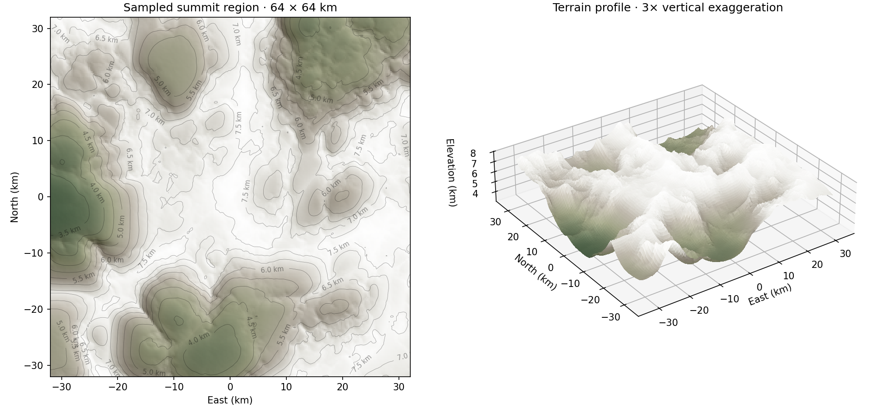

# Mountain terrain synthesis and optimization

Orbit now generates mountain ranges approaching 8 km above sea level while retaining deterministic, random-access sampling on its spherical planet. The implemented recipe combines continental fields, regional selection, vector domain warping, ridged multifractal relief, and footprint-filtered surface detail. A 65,536-point equal-area spherical survey of the sandbox seed finds a highest sample of **7,873.71 m**, compared with **7,000.71 m** for the previous recipe. The new terrain is bounded below 8,000 m above the configured sea level; the survey establishes an observed peak, not the exact global maximum.

The useful optimization result is more detail at approximately the previous close-range sampling cost, with substantial savings at coarser footprints. A representative dense mountain page is still **6.48% more expensive** than the old, simpler terrain. That tradeoff is explicit: this is not a universal speedup or a measured frame-rate improvement.

The earlier moving-clipmap corruption is separately closed by user confirmation. Its fix remains in place: morph-dependent samples are refreshed together with their matching ring frames and residency origins.

## Terrain model

Layered noise needs different roles, rather than simply more octaves of the same signal. Libnoise's terrain tutorial combines a terrain selector with different flat and mountainous generators; its ridged multifractal implementation also uses previous-octave feedback. These are useful precedents for separating hills from ranges and making fine ridges depend on larger landforms.[^1][^2]

| Component | Implemented role | Main scale or bound |
|---|---|---|
| Continental and climate fields | Broad land/ocean structure, broad uplift, temperature and moisture | Existing global wavelengths retained |
| Regional value noise | Broad variation and range selection | 800 km wavelength; 1,200 m amplitude |
| Vector domain warp | Bend the coordinate field before ridge evaluation | 70 km wavelength; 9 km displacement amplitude per component |
| Ridged multifractal | Mountain crests, secondary ridges, quieter valleys | 24 km initial wavelength; up to 8 octaves; lacunarity 2.03 |
| Hill/detail fBm | Hills outside ranges and fine surface variation | 40 km initial wavelength; 320 m amplitude; up to 10 octaves |
| Elevation headroom | Keep mountains and detail under the requested ceiling | 8,000 m above sea level |

Domain warping perturbs input coordinates with a coherent field before evaluating another field. Libnoise documents this as turbulence, including control of frequency and strength.[^3] Orbit evaluates three warp components from one hashed lattice, then rotates the coordinates between ridge octaves. Both operations help disrupt persistent lattice alignment. The warp is evaluated in three-dimensional planet coordinates, so it does not introduce a separate seam at each cube face.

The range mask reuses the continental land mask and the regional noise already needed for broad terrain. An additional smooth coastal gate suppresses mountain uplift at and below sea level. Areas with a zero mask bypass the mountain evaluator entirely. Inside strong ranges, the ridge spectrum replaces overlapping broad hill noise; fine surface noise remains. The crossfade has an exact zero region, allowing those redundant hill octaves to be skipped without creating a discontinuity at the range boundary.

This is a procedural landform model, not a tectonic or erosion simulation. Existing regional hydrology, erosion, carving, and water systems still consume the authoritative source. Their caches receive a recipe revision fingerprint covering the planet radius, seeds, noise settings, climate parameters, and generator version. A change in the recipe therefore identifies different source data rather than silently reusing an old source revision.

## Elevation bounds and summit shape

Multiplying all existing heights would also deepen oceans and stretch broad hills. Hard-clipping a height sum at 8,000 m would create flat summit shelves. Even a smooth nonlinear cap applied after all ridge detail can visibly flatten the highest terrain.

The implementation first limits the broad background smoothly. It then gives mountain relief the available headroom between that background and the ceiling. If the background height is `b`, the ceiling is `c`, the range mask is `m`, and normalized ridge relief is `r`, the mountain contribution is:

```text
h = b + m * min(configuredRelief, c - b) * r
0 <= m <= 1
0 <= r <= 1
```

The configured 11 km relief is a potential amplitude, not an allowed final mountain elevation. Near the top of the range it is restricted by the remaining elevation headroom. The normalized ridge remapping `r + 0.85*r*(1-r)` is monotonic and maps `[0,1]` into `[0,1]`.

The signed detail spectrum has amplitudes `A, A/2, A/4, ...`, so its absolute sum is less than `2A`. Its gain is at most `(c-h)/(2A)`. This reserves enough room for detail before adding it, rather than deforming finished crests afterward. The bound also covers the band filtering and terrain crossfade because their weights remain between zero and one.

The coarse-elevation output contains the generated landforms before the final local detail. Climate receives the additional elevation lapse after relief is added, so high summits are colder than the original broad global climate alone would predict. Biomes are classified from that final elevation and corrected temperature.

The default sandbox starts over a surveyed mountain range, with its starting altitude set at least 2.5 km above the authoritative ground sample. This avoids placing the camera inside a taller initial landscape.

## Filtering and temporal stability

The established noise-filtering principle is to omit frequencies beyond what the sampling footprint can resolve and fade the last contributing band smoothly. PBRT describes this for fBm, including the distinction between dropping zero-mean noise and preserving a nonzero mean for functions such as turbulence.[^4]

Orbit retains its quintic footprint fade: an octave is absent when its wavelength is at most twice the footprint, fully present at four times the footprint, and smoothly blended between those limits. For warped ridges, the effective footprint is enlarged to account for coordinate distortion and ridge shaping.

For the chosen vector value noise, a lattice edge can differ by at most 2, and the maximum derivative of the quintic fade is 1.875. Each entry of the vector-noise Jacobian is therefore bounded by 3.75. A conservative spectral-norm bound for the 3-by-3 matrix is 11.25. The warp's sampling scale is consequently bounded by:

```text
warpFootprintScale = 1 + 11.25 * warpAmplitude / warpWavelength
ridgeFootprint = inputFootprint * warpFootprintScale * 2
```

The extra factor of two is a conservative heuristic for nonlinear ridge shaping, not a proof that the final shaped terrain is band-limited. Absolute-value ridges, masks, and feedback introduce additional frequencies. The filter is a practical continuous approximation; it is not an exact area integration or a replacement for a fully prefiltered terrain pyramid.

Positive ridge noise cannot simply be replaced with zero when unresolved, because whole distant ranges would lose their average uplift. The implementation uses an approximate mean of 0.5 before the ridge remapping and a geometric-series tail for unresolved octaves. The first-octave fast path uses the same remapping as the general path. Tests exercise both sides of every ridge fade boundary to catch inconsistent fast paths.

The existing clipmap architecture is well matched to filtering by scale. Losasso and Hoppe's geometry clipmaps maintain nested regular grids and incrementally update them as the viewer moves.[^5] Orbit's newly fixed morph refresh must continue to operate on its frame-dependent payload; changing the terrain noise does not make that payload safe to reuse indefinitely.

## Implemented CPU savings

**Shared lattice work.** The scalar value-noise implementation explicitly computes the six axis hashes needed by the eight corners of a cell. The old expression evaluated three axis hashes at every corner. The optimized scalar function retains the established scalar field, verified against the original eight-corner formula over 4,096 inputs with varying seeds and negative coordinates. This is a source-level reduction in repeated expressions; an optimizing compiler may already eliminate some repetitions, so no isolated hardware speedup is claimed for this change alone.

**One vector lattice for the warp.** Each mixed 64-bit corner hash supplies three disjoint 21-bit channels. All channels share coordinate flooring, corner hashes, and fade weights. Three components still require interpolation, but they do not require three independent lattice constructions. Tests check finite bounds, nondegenerate variation, and obvious cross-channel correlation on a deterministic sample set. This is a practical decorrelation check, not a formal statistical certification.

**Prepared octave tables.** Frequencies, wavelengths, amplitudes, and seeds are computed once when the immutable terrain source is created. Fixed-size arrays cap the recipe at 16 octaves per family. Sampling does not allocate memory or prepare a dynamic noise graph.

**Single final biome classification.** The analytic sampler normalizes the direction once, requests unclassified global fields, adds relief, corrects the lapse rate, and classifies biomes once. The public standalone global-field sampler still returns its full classified result.

**Conditional work.** Ocean locations can skip mountain synthesis. Fully unresolved mountain bands use their approximate mean without evaluating the warp. Once an octave is fully filtered out, the remaining ridge tail is evaluated analytically and remaining fBm bands are omitted. Strong ranges skip broad fBm that duplicates their ridge spectrum.

**Mountain-only storage cost.** The mountain change used the existing 20-byte rendering payload. The later standing-water correction adds a 4-byte water-depth value (24 bytes total); see [standing water rendering](../STANDING_WATER_RENDERING.md). The measurements below predate that water change and are not timings of the combined renderer. The immutable mountain tables increase source-object storage, not every resident terrain sample.

## Measurements

Measurements were taken on the local AMD Ryzen 7 9800X3D, Windows, MSVC Release build, with the repository warning policy enabled. The graphics adapter is an RTX 4090, but the following numbers measure CPU terrain sampling and page construction; they do not measure GPU throughput.

The baseline source is commit `16d37777c80cc8be0c2b502f6cbb102400ddd94b`, using the old sandbox's explicit recipe and seed `0xA57E22A`. The baseline was rebuilt in an isolated directory using the same benchmark harness. The new version uses the updated default recipe with that same seed. Thus this compares two terrain recipes and implementations, not an optimization-only A/B with identical elevations.

Each planet pass samples 65,536 precomputed, approximately equal-area Fibonacci-sphere directions. Each page pass builds a complete 65-by-65 terrain page, including cube projection and cache packing. Each executable performs one warm-up and seven measured repetitions. The reported value is the median of the per-executable medians across three alternating baseline/new runs. Checksums retain the sampled results. All coordinates and footprints are shared between the two versions.

| Workload | Previous terrain | New mountain terrain | CPU time change |
|---|---:|---:|---:|
| Planet, 20 m footprint | 39.5962 ms | 38.2441 ms | -3.41% |
| Planet, 200 m footprint | 40.2322 ms | 31.9002 ms | -20.71% |
| Planet, 2 km footprint | 33.3221 ms | 25.5714 ms | -23.26% |
| Planet, 20 km footprint | 27.4313 ms | 17.6714 ms | -35.58% |
| Planet, 200 km footprint | 22.9007 ms | 18.1015 ms | -20.96% |
| Original-location page, L5 | 2.1350 ms | 1.5217 ms | -28.73% |
| Original-location page, L9 | 2.6663 ms | 1.8821 ms | -29.41% |
| Original-location page, L13 | 2.7628 ms | 2.1764 ms | -21.22% |
| Mountain page, L5 | 2.2889 ms | 1.3488 ms | -41.07% |
| Mountain page, L9 | 2.6756 ms | 2.0759 ms | -22.41% |
| Mountain page, L13 | 2.7848 ms | 2.9652 ms | +6.48% |

The small 20 m improvement should be treated as approximately equal cost, given ordinary desktop timing variation. The wider coarse-footprint savings are more substantial. The finest mountain page is about 0.70 microseconds per sample and costs more than the previous recipe. This page represents the expensive mountain branch; the planet-wide result includes many ocean and lowland samples where that branch is skipped.

The original-location pages are now largely ocean/coastal terrain because the background recipe changed. Their savings should not be generalized to every mountain location. Conversely, timing only the mountain peak would overstate the average cost of a spherical terrain survey. Both workloads are retained to make that distinction visible.

The survey's new median elevation is approximately -705 m, its 95th percentile is 4,669 m, and its 99th percentile is 6,664 m. Ocean basins remain, with a sampled minimum near -4,318 m. These are statistics for one seed, not a target distribution for every possible seed.



This figure is generated from the authoritative analytic height samples around the highest surveyed point. It covers 64 by 64 km at 250 m plotting intervals; the source queries use a 20 m footprint. The perspective panel uses threefold vertical exaggeration. It is not a screenshot of the runtime renderer, and it excludes regional erosion and water overlays. A finite plotting grid cannot display every detail present in the analytic source.

## Higher-impact optimization roadmap

### Fused SIMD page sampling

FastNoise2 demonstrates a useful architecture: keep noise evaluation and its operators together inside a SIMD graph, retaining intermediate values in registers instead of building multiple temporary arrays. It supports runtime selection among instruction sets. Its public benchmark figures describe a different machine, compiler, and isolated noise workload; they are not predictions for Orbit.[^6]

For Orbit, the first prerequisite is a batch sampling interface with a scalar default and an optimized analytic implementation. Page construction and sample-streaming patches can then supply consecutive query batches. Keep global fields, masks, ridge feedback, and biome decisions inside the batch rather than vectorizing only a tiny noise function and returning to scalar code between every operator.

The initial experiment should compare scalar and batched page builds at the exact same seed, coordinates, and footprints. Include cold mountain pages, ocean pages, and mixed-mask batches; branch divergence matters. Test architecture dispatch and fallback on machines without the newest instructions. Preserve double-precision coordinate reduction or establish a measured positional error budget before moving global coordinates to floats. The current scalar implementation is the correctness reference.

FastNoise2's repository specifically recommends ClangCL on Windows because of reported MSVC SIMD compiler issues.[^6] Adding it would therefore require a pinned version, isolated backend boundary, compiler validation, license review, and output parity tests. No new SIMD dependency or global instruction-set requirement is introduced in this change.

### GPU clipmap residuals and normal generation

Asirvatham and Hoppe's GPU clipmap implementation moves synthesis, upsampling, residual addition, and normal updates into GPU passes while keeping reusable grid topology.[^7] The architectural idea is relevant; its 2005 hardware timings are historical and should not be compared with the current desktop.

Orbit currently evaluates much of its spherical projection, terrain-normal construction, and ring-hole rejection per vertex invocation. A compute pass over dirty samples could prepare GPU-only render data once per updated sample, leaving authoritative CPU heights available for hydrology and collision. Normals require a dirty-region halo because an updated sample affects its neighbors. Coarse/fine morph inputs must retain explicit frame and source revisions.

This experiment should measure total frame time, upload bytes, dispatch overhead, resource barriers, and queue overlap. Reducing CPU arithmetic while increasing synchronization or transfer latency can make the application slower. A useful GPU path should not require reading the complete heightfield back every frame.

### Static indexed topology and earlier hole rejection

The current 65-by-65 patch invokes the vertex shader `64*64*6 = 24,576` times. It has only 4,225 unique grid vertices, a ratio of about 5.82. A reusable indexed topology could expose substantial vertex reuse; alternatively, moving rejection of ring-hole cells ahead of expensive shader work could avoid processing discarded geometry. These are opportunities inferred from Orbit's current code, not measured speedups.

The index ratio is an upper-bound work comparison, not a 5.82-fold frame-rate promise. Post-transform cache behavior, ring holes, shader arithmetic, and rasterization all affect the result. An indexed implementation also needs correct per-cell hole topology because the current non-indexed shader collapses all corners of a hole cell together. Prototype and capture shader-invocation counts before changing the renderer.

### Prefiltered shared global fields

Continents and climate vary slowly relative to a fine terrain page. An explicit low-resolution cache of these fields could avoid repeated global-noise and climate work for every local sample. It should be spherical, seam-aware, revisioned, and interpolated from shared samples. The cache must preserve the same field for camera, hydrology, and rendering consumers.

This is an approximation unless it stores the exact queried values. Quantify elevation error, classification changes, coastline displacement, and cache memory before selecting a resolution. Cache lookup overhead can dominate if the original fields are already cheap; benchmark the complete page path.

### Slope-directed erosion patterns

Grenier, Guérin, Galin, and Sauvage describe structured noise based on phasor patterns whose scale and orientation follow terrain characteristics, including slope and water flow. Their work is a stronger direction for coherent ravines than adding undirected high-frequency noise.[^8] The accessible publisher abstract supports this characterization; the full implementation and performance evaluation were not reviewed here.

For Orbit, preserve the existing regional hydrology as the flow source and investigate slope-directed residuals near the observer. Evaluate whether analytic derivatives can provide orientation without several extra scalar samples. Validate ravine continuity across region boundaries and interaction with river carving. Until these are established, the current ridged terrain should not be described as physically eroded mountain geology.

### Stochastic procedural-noise evaluation

Fajardo and Pharr show how Monte Carlo estimates of procedural noise can reduce evaluation cost within densely sampled path-tracing estimators.[^9] That context is materially different from an authoritative terrain height query.

Introducing fresh random height error would affect collision, drainage, cache consistency, and temporal geometry stability. Stochastic evaluation is therefore not recommended for the current authoritative heightfield. A later render-only appearance layer with a suitable reconstruction or accumulation scheme would be a separate experiment. Any deterministic seed alone is insufficient to establish that an approximation preserves required heights or drainage behavior.

## Validation and reproduction

The dedicated mountain test checks the elevation ceiling over five footprints at 65,536 spherical directions, cold alpine summits, retained ocean basins, non-flat local summit relief, continuous ridge fade boundaries, source revision changes, and exact agreement between concurrent and serial queries. Scalar noise equivalence and basic vector-warp statistics are checked separately in the same executable.

The existing planet, field, sample-streamer, morph-refresh, regional terrain, regional streaming, and hydrology tests pass. The broader suite still has the previously observed cache-budget failure, and the old camera tests still reference removed camera configuration fields and cannot compile. These failures are not silently removed from the test configuration.

The Release sandbox boots and responds to a multi-second flight through the mountain region. Streaming continues during motion, derived region requests settle, and the inspected run has no stderr errors. This is a runtime smoke test, not a visual certification of every LOD seam or shoreline. The analytic heightfield figure provides separate inspection of the generated landforms.

Build and run the maintained harness:

```powershell
cmake --build build --config Release --target OrbitTerrainBenchmark OrbitTerrainMountainTests
ctest --test-dir build -C Release -R '^Orbit.TerrainMountains$' --output-on-failure
.\build\tests\Release\OrbitTerrainBenchmark.exe build/terrain-heightfield.csv
python tools/render_terrain_survey.py build/terrain-heightfield.csv build/terrain-heightfield.png
```

Benchmark stdout is CSV timing data; stderr contains the height survey and peak direction. The plotting script requires NumPy and Matplotlib. Timing is deliberately outside CTest because wall-clock thresholds are unsuitable as portable correctness assertions. The saved comparison is [terrain-benchmarks.csv](terrain-benchmarks.csv).

For a repeatable summit visit with the sandbox seed, the sampled peak direction is approximately `(0.2179860341, -0.1605682373, -0.9626525490)`. The development server can use that direction with an altitude of 10,500 m above the base sphere. Its current altitude parameter is a sea/base-sphere altitude rather than an above-ground clearance request.

## Sources

[^1]: Jason Bevins. [Tutorial 5: Creating more complex terrain](https://libnoise.sourceforge.net/tutorials/tutorial5.html). Libnoise documentation, undated; accessed September 13, 2026. Terrain-type selection and mixing mountain and flatter generators.

[^2]: Jason Bevins. [noise::module::RidgedMulti class reference](https://libnoise.sourceforge.net/docs/classnoise_1_1module_1_1RidgedMulti.html). Libnoise documentation, copyright 2003–2005; accessed September 13, 2026. Absolute-value ridge construction and inter-octave feedback.

[^3]: Jason Bevins. [Tutorial 6: Adding realism with turbulence](https://libnoise.sourceforge.net/tutorials/tutorial6.html). Libnoise documentation, undated; accessed September 13, 2026. Coordinate perturbation and warp parameters.

[^4]: Matt Pharr, Wenzel Jakob, and Greg Humphreys. [Physically Based Rendering, third edition, §10.6: Noise](https://www.pbr-book.org/3ed-2018/Texture/Noise). Online 2018 edition; accessed September 13, 2026. Footprint-based octave filtering and nonzero-mean noise treatment.

[^5]: Frank Losasso and Hugues Hoppe. [Geometry clipmaps: Terrain rendering using nested regular grids](https://hhoppe.com/proj/geomclipmap/). ACM Transactions on Graphics, SIGGRAPH 2004. Nested grids and incremental terrain updates.

[^6]: Auburn. [FastNoise2 repository and README](https://github.com/Auburn/FastNoise2). Live project documentation; accessed September 13, 2026. Fused SIMD graphs, dispatch, benchmark context, and the project's MSVC caveat. Reported third-party benchmark figures were not independently reproduced.

[^7]: Arul Asirvatham and Hugues Hoppe. [GPU Gems 2, Chapter 2: Terrain Rendering Using GPU-Based Geometry Clipmaps](https://developer.nvidia.com/gpugems/gpugems2/part-i-geometric-complexity/chapter-2-terrain-rendering-using-gpu-based-geometry). NVIDIA, 2005. GPU synthesis, normal updates, and reusable topology.

[^8]: Charline Grenier, Éric Guérin, Éric Galin, and Basile Sauvage. [Real-time Terrain Enhancement with Controlled Procedural Patterns](https://diglib.eg.org/items/43319e3d-ba25-4762-971b-ac838ec21fb8). Computer Graphics Forum 43(1), 2024, DOI 10.1111/cgf.14992. Publisher abstract reviewed; full paper retrieval was unavailable.

[^9]: Marcos Fajardo and Matt Pharr. [Fast Procedural Noise By Stochastic Sampling](https://research.nvidia.com/publication/2023-06_fast-procedural-noise-stochastic-sampling). Eurographics Symposium on Rendering, June 2023. Stochastic noise evaluation in Monte Carlo rendering.
